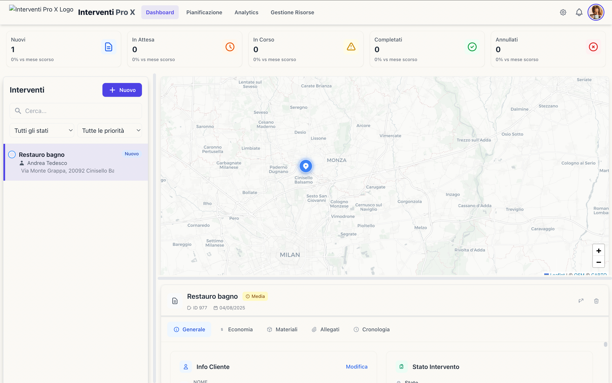
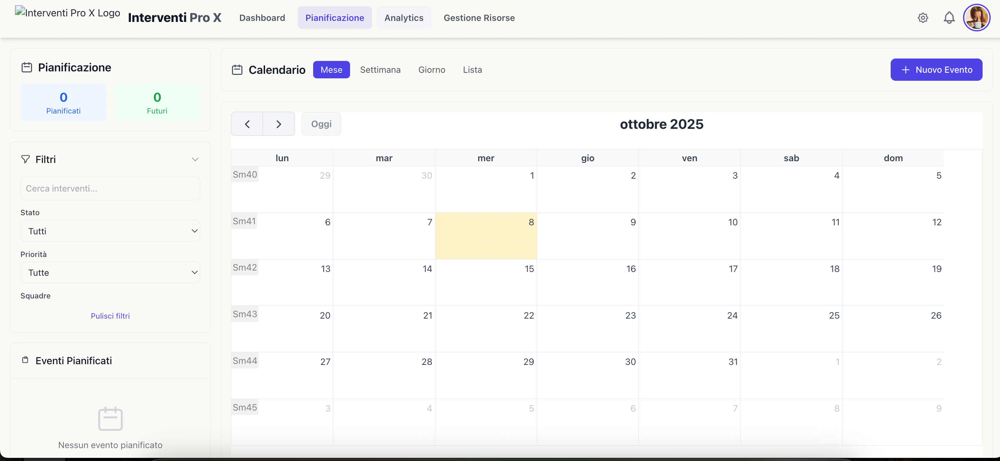
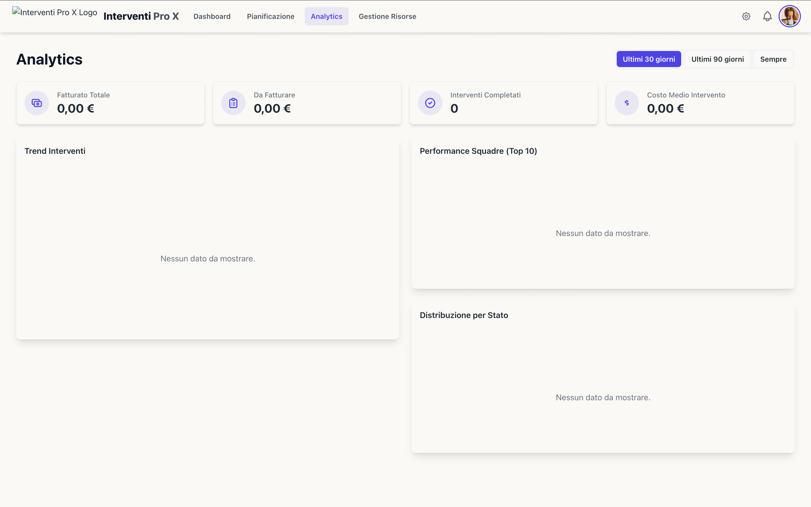

# Gestionale Interventi Pro X

**Gestionale Interventi Pro X** è un'applicazione web moderna e reattiva progettata per la gestione avanzata di interventi tecnici sul campo. Combina un'interfaccia intuitiva per l'inserimento e il monitoraggio degli interventi con potenti funzionalità di geolocalizzazione e mappe interattive.

## Funzionalità Principali

- **Dashboard Riepilogativa**: Visualizzazione immediata dello stato degli interventi (Nuovi, In Attesa, In Corso, Completati, Annullati).
- **Gestione Interventi Completa**: Creazione, modifica e visualizzazione di interventi con dettagli su cliente, stato, priorità, aspetti economici, materiali usati, allegati e cronologia.
- **Pianificazione Interattiva (Calendario)**: Una vista calendario completa (mensile, settimanale, giornaliera) dove gli interventi sono visualizzati come eventi. Supporta il drag & drop per riprogrammare e il ridimensionamento per modificare la durata.
- **Gestione Risorse (CRUD)**: Aggiunta, modifica ed eliminazione di personale, veicoli e squadre, con dettagli anagrafici e sull'equipaggiamento.
- **Lista Interventi Dinamica**: Ricerca testuale e filtraggio per stato e priorità.
- **Mappa Interattiva (Leaflet)**: Geolocalizzazione di tutti gli interventi e dei tecnici in tempo reale.
- **Visualizzazioni Mappa Multiple**: Supporto per viste Standard, Cluster (per aggregare i marker) e Heatmap (per visualizzare le densità).
- **Geolocalizzazione Avanzata con AI**: Ricerca indirizzi potenziata da Google Gemini API per la massima precisione, con fallback su OpenStreetMap.
- **Design Moderno e Adattivo**: Interfaccia pulita realizzata con TailwindCSS, supporto per tema chiaro e scuro, e layout resizable.
- **Persistenza Dati Robusta**: I dati vengono salvati in un database **IndexedDB** locale al browser, garantendo che tutte le modifiche siano persistenti e che l'applicazione sia veloce e scalabile.

---

## Dettaglio Funzionalità

### 1. Dashboard e Gestione Interventi

Il cuore dell'applicazione è un sistema CRUD completo per la gestione degli interventi.

- **Creazione e Modifica**: Un modale dedicato permette di inserire nuovi interventi. La modifica avviene direttamente all'interno delle schede dei dettagli per un flusso di lavoro più rapido ("in-place editing").
- **Lista Interattiva**: La barra laterale, la cui larghezza è regolabile tramite drag & drop, mostra la lista completa degli interventi. È possibile:
    - **Cercare** per titolo, indirizzo, nome cliente o ID.
    - **Filtrare** per `Stato` e `Priorità`.
- **Dettagli Intervento a Schede**: Selezionando un intervento, il pannello inferiore mostra tutte le informazioni pertinenti in tab dedicati per un'organizzazione ottimale:
    - **Generale**: Informazioni su cliente, indirizzo (con link per centrare la mappa), gestione di stato, priorità, tecnico assegnato e note.
    - **Economia**: Un quadro completo degli aspetti finanziari, inclusi costi di materiali e manodopera, IVA, totale e stato del pagamento (es. `Da Fatturare`, `Pagata`).
    - **Materiali**: Dettagli sull'asset del cliente (es. una specifica caldaia) e una lista dei materiali di ricambio e attrezzature impiegate.
    - **Allegati**: Una galleria di file e immagini (es. foto prima/dopo, documenti PDF) con anteprima a schermo intero.
    - **Cronologia**: Un log immutabile di tutte le attività e i cambiamenti relativi all'intervento.

### 2. Pianificazione con Calendario

Una nuova sezione "Pianificazione" offre una visione strategica e interattiva degli impegni.

- **Viste Multiple**: Il calendario può essere visualizzato per mese, settimana, giorno o come una lista di impegni.
- **Eventi Interattivi**: Ogni intervento programmato appare come un evento sul calendario, colorato in base al suo stato.
- **Drag & Drop**: Gli interventi possono essere facilmente riprogrammati trascinando l'evento corrispondente a una nuova data o ora.
- **Durata Modificabile**: È possibile modificare la durata di un intervento semplicemente ridimensionando l'evento.
- **Filtro per Squadra**: Una barra laterale permette di filtrare il calendario per visualizzare gli impegni di una o più squadre specifiche, offrendo una chiara visione del carico di lavoro.

### 3. Gestione Risorse

La sezione "Gestione Risorse" è ora un modulo completo per amministrare il personale, i veicoli e le squadre.

- **CRUD Completo**: È possibile aggiungere, modificare ed eliminare ogni tipo di risorsa.
- **Personale**: Oltre a nome, ruolo e stato, è possibile gestire informazioni di contatto come email e telefono.
- **Veicoli**: Ogni veicolo ha dettagli come targa, tipo e stato, oltre a una lista di equipaggiamento a bordo.
- **Squadre**: Si possono creare squadre assegnando membri del personale e un veicolo. Il sistema facilita la composizione delle squadre con comodi selettori.
- **Logica di Business**: Sono stati implementati dei controlli per prevenire l'eliminazione di risorse in uso (es. un membro del personale assegnato a una squadra).

### 4. Mappa Interattiva

La mappa è il centro visivo delle operazioni sul campo.

- **Marker Dinamici**:
    - Gli **interventi** sono rappresentati da marker colorati in base al loro stato. Gli interventi `Urgente` hanno un'animazione pulsante per attirarare l'attenzione. Il marker selezionato viene ingrandito.
    - I **tecnici** (tramite i veicoli delle squadre) sono visualizzati con un'icona distinta.
- **Controlli Mappa**: Un'icona in alto a destra apre un pop-up per personalizzare la mappa:
    - **Stile Mappa**: Si può scegliere tra un tema "Chiaro" (CartoDB Positron) e uno "Dettagliato" (OpenStreetMap), entrambi con varianti per il tema light/dark dell'applicazione.
    - **Visualizzazione (Overlay)**:
        - **Standard**: Tutti i marker sono visibili singolarmente.
        - **Cluster**: I marker vicini vengono raggruppati in cerchi numerati, ideali per visualizzare un alto numero di interventi.
        - **Heatmap**: Mostra una mappa di calore basata sulla concentrazione degli interventi.

### 5. Persistenza dei Dati con IndexedDB

Per garantire un'esperienza utente affidabile e performante, l'applicazione non si basa più su dati fittizi in memoria, ma utilizza un vero database lato client.

- **Database**: **IndexedDB** viene utilizzato per archiviare tutti i dati (interventi, clienti, tecnici, asset).
- **Libreria**: **Dexie.js** agisce come un wrapper semplice e potente per IndexedDB, facilitando le operazioni di lettura e scrittura.
- **Reattività**: Grazie a `dexie-react-hooks`, l'interfaccia si aggiorna automaticamente e in tempo reale a ogni cambiamento nel database.
- **Primo Avvio**: Al primo utilizzo, il database viene automaticamente popolato con un set di dati di esempio per una demo completa.

---

## Stack Tecnologico

- **Frontend**: React 18
- **Linguaggio**: TypeScript
- **Gestione Dati Client-Side**: IndexedDB con Dexie.js e Dexie React Hooks
- **Styling**: TailwindCSS (con configurazione JIT per temi light/dark e colori personalizzati)
- **Mappe**: Leaflet.js (con plugin per MarkerCluster e Heatmap)
- **Calendario**: FullCalendar
- **Intelligenza Artificiale**: Google Gemini API (`gemini-2.5-flash`) per:
    - Geolocalizzazione e reverse-geocoding di precisione.

# Preview 

